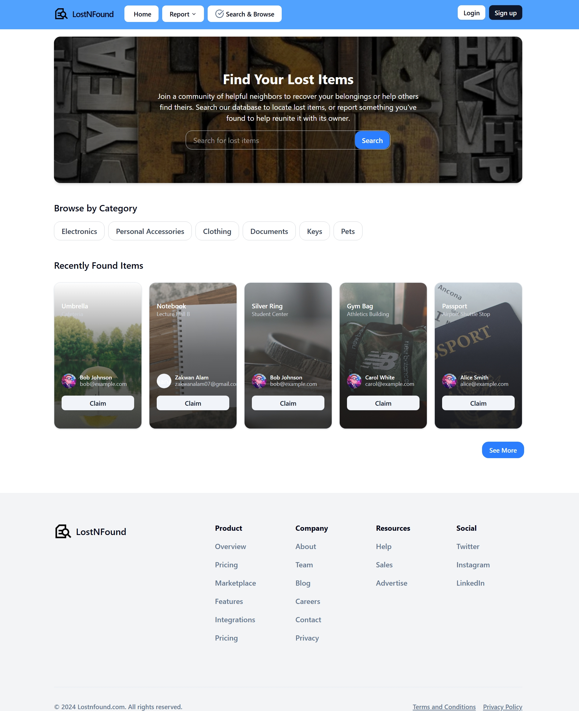

# Lost & Found App

This is an ongoing web application project designed to help users report and claim lost or found items within an organization or community. The goal is to streamline the process of item recovery through a simple, user-friendly interface.

## 🚧 Project Status
🛠️ **Currently in development** — actively building features and improving UI.

## ✨ Features (Work in Progress)
- Report a lost or found item
- View and search listed items
- Claim verification system
- Add Items
- User dashboard (My Items, My Claims)
- Admin panel for moderation

## 📸 Screenshots
Below are some early-stage screenshots from the project.

